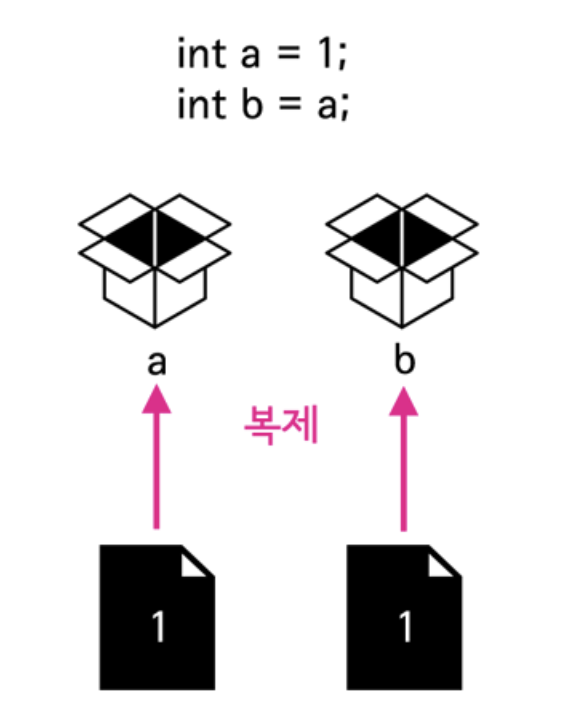
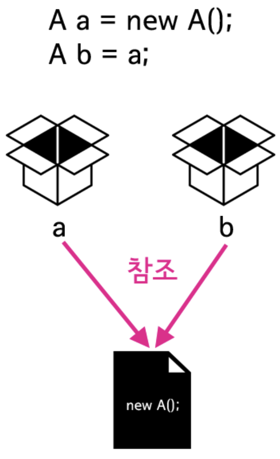
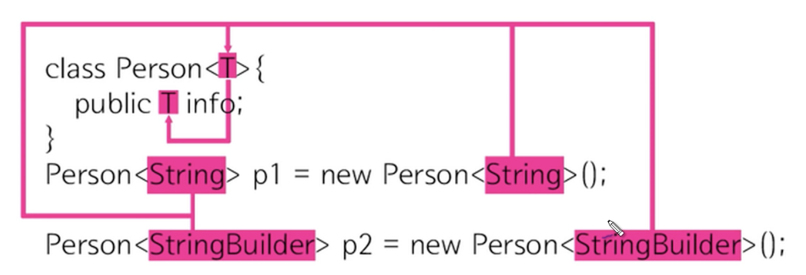
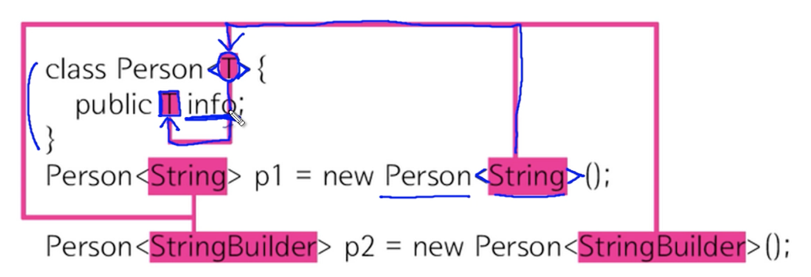
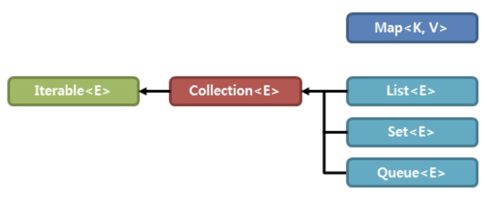
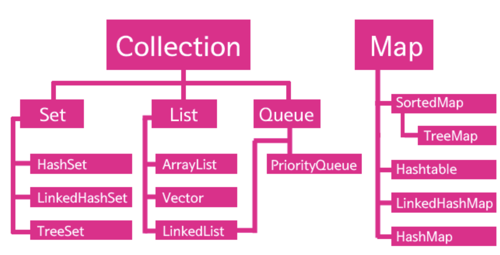
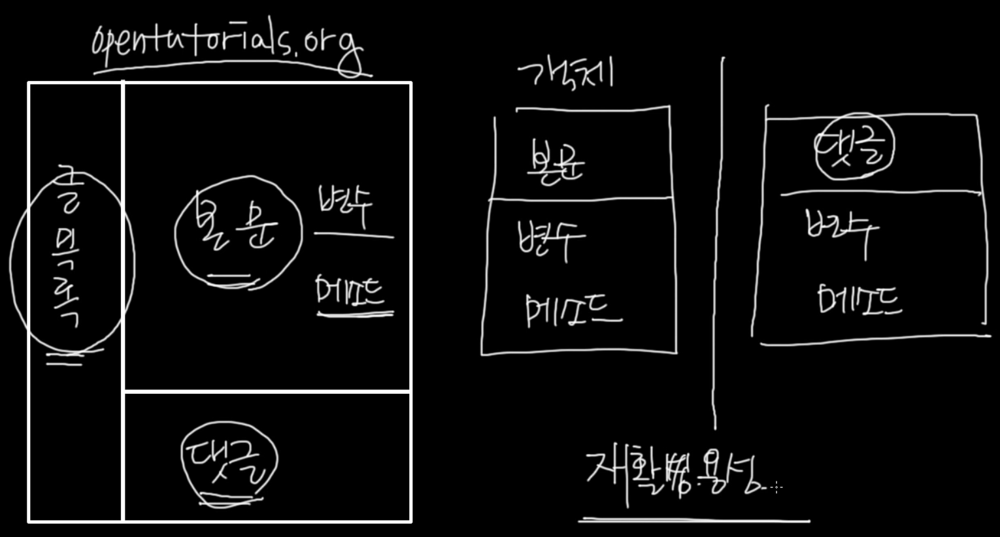
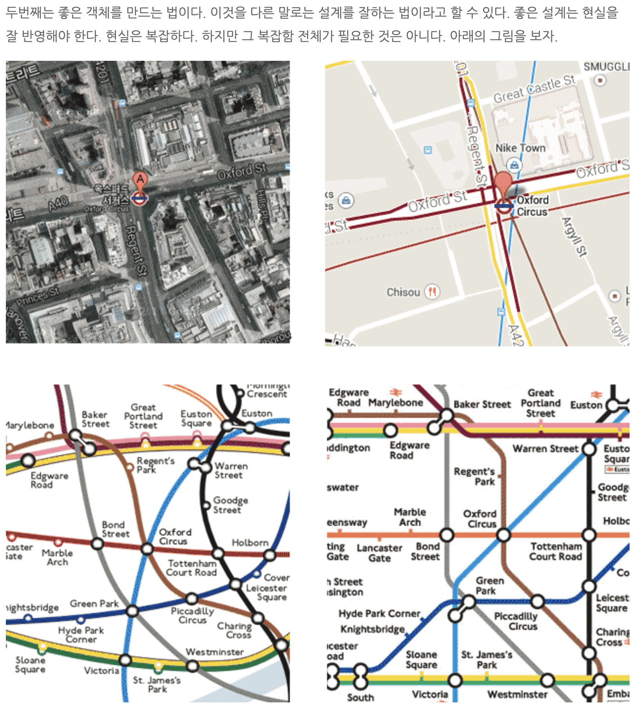

Java
---

 1. 완전 기초 프로그래밍 강좌 

 - 강의 : https://www.youtube.com/watch?v=A74TOX803D0
 - naming conventions : https://www.freecodecamp.org/news/programming-naming-conventions-explained/

⭐️ Contents ⭐️

1) Hello World 

- 

2) Variables

3) Data Types

- primitive types
  - boolean type
    - boolean
  - numeric type
    - byte
    - short
    - int
    - long
    - double
    - float
  - text type
    - char 
- reference types=non-primitive types(아래 더 자세히)
  - array
  - enum
  - class
  - interface

4) Operators

  
  - arithmetic operators
  - logical operators
  - relational operators
  - incremental/decremental operators

 5) Strings

  
  - char/String
  - String/ new String
  - String.format()
  - string.length()
  - string.isEmpty()
  - string.toUpperCase() / toLowerCase()
  - string == string2 
  - string.equals(string2) => value만 체크, equalsIgnoreCase()
  - string.replace("a","b")
  - string.contains("a") => boolean
  

 6) User Inputs

 
 - Scanner 00 = new Scanner(System.in) / scanner.close()
 - line -> int -> line 이런식 + <enter> 가 이 전 buffer에 남아있어, 뒤에 해당 변수를 사용하면 적용됨.
   - solve1) cleans up the input buffer in the middle of logic
   - solve2) get inputs as string types and then convert into whatever you want.
   - 

 7) Conditional Statements

 - if 
 - else if
 - else

 8) Switch Cases

 - switch "keyword" - case "dd" + if-else도 섞어씀
 - break 반드시 넣어야 모든 case를 타지 않음

 9) Arrays

 - import java.util.Arrays
 - char vowels[] = new char[5] = char vowels[] = {1,2,3,4,5}
 - Arrays.toString
 - Arrays.sort
 - Arrays.searching
 - Arrays.fill
 - copy
   - copy by reference : =
   - copy by value : Arrays.copyOf, copyOfRange
 - Arrays.equals(A,B)

 10) For Loops / While Loops / Dp...While Loops

 - for (initializer, for문에 진입하는 condition, undate) { 내용 }
 - initializer, while (condition) {내용, update}

 11) ArrayLists

 
 - ArrayList is wrapper class of primitive reference types.
 - ex) ArrayList<Integer> numbers = new ArrayList<Integer>(); 
 - numbers.add()
 - numbers.remove()
 - numbers.set()
 - numbers.clear()
 - numbers.size()
 - numbers.sort()
 - numbers.contains()
 - numbers.forEach() : 람다 같은
 - numbers.isEmpty()

 12) HashMaps

 - 딕셔너리와 같이 key, value를 갖음 
 - ex) HashMap<String, Integer> examScores = new HashMap<String, Integer>();
 - examScores.put()
 - examScores.get()
 - examScores.putIfAbsent()
 - examScores.replace()
 - examScores.clear()
 - examScores.size()
 - examScores.remove()
 - examScores.containsKey(), containsValue()
 - examScores.isEmpty()
 - examScores.forEach()

 13) Object Oriented Programming (detail study of OOP is on notion page) 

 14) 참조 

-  

 - 복사 vs 참조
 - 참조는 기본형 데이터 타입 외의 데이터 타입이라고 볼 수 있음

 15) 제너릭 

- 
- 

 16) collections framework (feat. ArrayList, Hashmap) 

- 자바에서 컬렉션 프레임워크(collection framework)란 다수의 데이터를 쉽고 효과적으로 처리할 수 있는 표준화된 방법을 제공하는 클래스의 집합을 의미합니다.  
즉, 데이터를 저장하는 자료 구조와 데이터를 처리하는 알고리즘을 구조화하여 클래스로 구현해 놓은 것입니다. 이러한 컬렉션 프레임워크는 자바의 인터페이스(interface)를 사용하여 구현됩니다.

- 
- 

---

2. 객체 지향 프로그래밍 강좌 

 - 강의 : https://opentutorials.org/course/1223

⭐️ Contents ⭐️

1) 메소드 

- 사용하는 이유: 재활용/코드량줄고/유지보수 편함
- parameter(매개변수) : 입력을 위한 매개변수(파라미터), 입력값을 주기 위한
- 인자 : 입력값 argument
- return / return 나오면 메소드는 끝남
  - public static String numbering(int init, int limit) {}
    - String은 numbering return값의 타입
    - String[] => 문자열인 배
  - public statid void main (~~)
    - void는 return이 없다는뜻
  

2) 객체 지향 프로그래밍이란?  

- 객체는 그냥 변수와 메소드를 그룹핑한
- 
- 객체 지향 프로그래밍 교육은 1) 설계 2) 문법
  1) 설계 란?
  - 복잡함 속에서 필요한 관점만을 추출하는 행위를 추상화라고 하며, 프로그램을 만든다는 것은 소프트웨어의 추상화라고 할 수 있다.
  - 

  2) 문법 
  - 부품화(=분류) : 어디에서든 재활용이 가능하도록 하는거, 객체를 잘 만든다는것, 정답은 없고 적합한 것을 찾아내야 됨
  - 은닉화, 캡슐화 : 제대로 된 부품이라면, 그것이 어떻게 만들어졌는지 모르는 사람도 사용하는 방법만 알면 쓸 수 있어야함.
    - 내부의 동작 방법을 단단한 케이스(=객체) 안으로 숨기고, 사용자에게는 그 부품의 사용방법만을 노출 시키는 것
  - 인터페이스 : 부품과 부품을 서로 교환 할 수 있어야 한다. (ex 모니터-키포드 바꾸기 케이블의 규격이 같아서 가능할 수 있음)

3) 클래스와 인스턴스 그리고 객체 

- 객체 를 만들기 위해서 class(설계도):메소드의 정의/  instance(제품)
- 변수 = state, 메소드 = behave
- 메소드화 
  - 로직이 커지고, 내용이 복잡해지면, => 메소드를 사용해도 문제가 생김 막 섞임
- 객체화
  - 경우에 따라 sum도 하고, avg하고 싶을 때가 있음
  - ex) 계산기 객체를 만들고 싶음
  - 인스턴스 만듬
- this = instance 자신

4) 클래스 member, 인스턴스 member 

- 객체도 구성원이 있다. 바로바로
  - 변수
  - 메소드
  - 
- 클래스의 member
  - 클래스 변수 (static field) 
    - static을 맴버(변수,메소드) 앞에 붙이면 클래스의 맴버가 된다.
    - 인스턴스에 따라서 변하지 않는 값이 필요한 경우
    - 인스턴스를 생성할 필요가 없는 값을 클래스에 저장하고 싶은 경우
    - 값의 변경 사항을 모든 인스턴스가 공유해야하는 경우이 된다는 => 모든 메소드/인스턴스에서 동일하게 쓸 수 있는것
      - static이 없는건, instance의 변수임
  - 클래스 메소드
    - 인스턴스가 등장하지 않고, 클래스의 메소드로
      - public static void sum(~){}
  - 인스턴스 메소드는 클래스 멤버에 접근 할 수 있다.
  - 클래스 메소드는 인스턴스 멤버에 접근 할 수 없다.(아직 생성되지 않은 거에 접근하려는거니깐)

5) 유효범위 

6) 초기화와 생성자  

7) 상속 

8) 상속과 생성자  

9) Overriding  

10) Overloading  

11) Class path  

12) Package  

13) API와 API문서 보는 법  

14) 접근 제어자 

15) Abstract 

16) Final  

17) Interface  

18) 다형성(Polymorphism)  

19) 예외 처리 

20) Object 클래스 

21) 상수와 enum 

